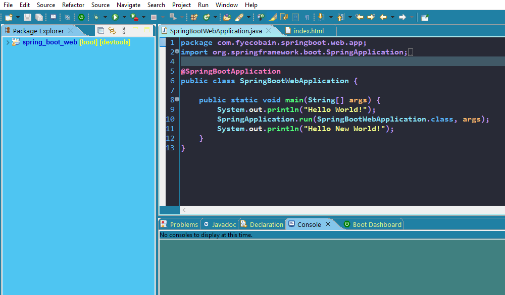

# Dracula-based theme configuration for the Eclipse IDE or Spring Tool Suite

## Version
> **1.2.0**

[](./screenshot.png)

## Color palette
#### Custom colors
> 1. **IDE Background**: #2080A4 > rgb(32, 128, 164)
> 2. **Light Gray**: #E1E1E1 > rgb(225, 225, 225)
> 3. **Light Blue**: #4EC5F2 > rgb(78, 197, 242)
> 4. **Dark Blue**: #0000C8 > rgb(0, 0, 200)
#### Dracula-based colors
> 5. **Dracula Background**: #282A36 > rgb(40, 42, 54)
> 6. **Dracula Comments**: #6272A4 > rgb(98, 114, 164)
> 7. **Dracula Selection**: #415967 > rgb(65, 89, 103)
> 8. **Dracula Cyan**: #8BE9FD > rgb(139, 233, 253)
> 9. **Dracula Dark Blue**: #58B3FC > rgb(88, 179, 252)
> 10. **Dracula Fucsia**: #FF79C6 > rgb(255, 121, 198)
> 11. **Dracula Yellow**: #F1FA8C > rgb(241, 250, 140)
> 12. **Dracula Green**: #50FA7B > rgb(80, 250, 123)
> 13. **Dracula Purple**: #BD93F9 > rgb(189, 147, 249)
> 14. **Dracula Orange**: #FFB86C > rgb(255, 184, 108)
> 15. **Dracula White**: #F8F8F2 > rgb(248, 248, 242)

## Instructions

### Overall Style

**1. Set the "Classic" theme:**
> Preferences > General > Appearance > Theme: **Classic**

**2. Set the background image:**
> 1. Install the [SimpleBackground](https://marketplace.eclipse.org/content/simplebackground) plugin.
> 2. Preferences > SimpleBackground > **Background image**: [background.png](./background.png) *(must match the scren size)*

**3. Set the console colors:**

> Preferences > Run/Debug > **Console**:
> 1. Standart Out text color: **Dracula White**
> 2. Background Color: **IDE Background**

**4. Add this **CSS** code to** _{ide_directory}\\plugins\\org.eclipse.ui.themes...\\css\\**e4_classic.css**_:

```
.MPart Tree {
        font-weight: bold;
        font-size: 10;
        color: #0000C8; /* Dark Blue */
        background-color: #4EC5F2; /*Light Blue*/
}
````

**5. Set the "Basic" colors:**
> Preferences > General > Appearance > Colors and Fonts > **Basic**:
> 1. Decoration color: **Yellow (255, 255, 0)**

**6. Set the "View and Editor Folders" colors:**
> Preferences > General > Appearance > Colors and Fonts > **View and Editor Folders**:
> 1. Active (non-focus) part background begin: **Light Gray**
> 2. Active (non-focus) part background end: **Light Gray**
> 3. Active (non-focus) part foreground: **Dracula Background**
> 4. Active part background begin: **White**
> 5. Active part background end: **White**
> 6. Active part foreground | Active part text color: **Dracula Background**
> 7. Inactive part background begin: **Light Gray**
> 8. Inactive part background end: **Light Gray**
> 9. Inactive part foreground | Inactive part text color: **Dracula Yellow**

> **Tip 1**: Restart the IDE here to see the current changes.

> **Tip 2**: You can avoid the following configuration by copying the **.PREFS** files to this directory:
_{ide_workspace}\\.metadata\\.plugins\\org.eclipse.core.runtime\\.settings\\_

**7. Set the "Text Editors" colors:**
> Preferences > General > Editors > **Text Editors**:
> 1. Line number foreground: **Dracula Dark Blue**
> 2. Current line highlight: **Dracula Selection**
> 7. Background color: **Dracula Background**

**8. Set the "Annotations" colors:**
> Preferences > General > Editors > Text Editors > **Annotations**:
> 1. Matching Tags: **IDE Background**
> 2. Ocurrences: **IDE Background**
> 3. Write Ocurrences: **IDE Background**

### Java

**1. Set the Java "Editor" colors:**
> Preferences > Java > **Editor**:
> 1. Matching brackets hightlight: **Dracula Cyan**
> 2. Parameter hints background: **IDE Background**
> 3. Parameter hints foreground: **Dracula White**

**2. Set the Java "Syntax Coloring":**
> Preferences > Java > Editor > Syntax Coloring > **Java**:
> 1. Abstract classes: **Dracula Cyan**
> 2. Abstract method invocations: **Dracula Green**
> 3. Annotation element references: **Dracula Dark Blue**
> 4. Annotations: **Dracula Fucsia**
> 5. Auto(un)boxed expressions: **Dracula Orange**
> 6. Brackets: **Dracula Purple**
> 7. Classes: **Dracula Cyan**
> 8. Deprecated members: **Dracula Orange (Strikethrough)**
> 9. Enums: **Dracula Cyan**
> 10. Fields: **Dracula White**
> 11. Inherit fields: **Dracula White**
> 12. Inherit method invocations: **Dracula Green**
> 13. Interfaces: **Dracula Cyan**
> 14. Keyword 'return': **Dracula Fucsia**
> 15. Keywords excluding 'return': **Dracula Dark Blue**
> 16. Local variable declarations: **Dracula White**
> 17. Local variables: **Dracula White**
> 18. Method declarations: **Dracula Green**
> 19. Methods: **Dracula Green**
> 20. Numbers: **Dracula Dark Blue**
> 21. Operators: **Dracula Purple**
> 22. Others: **Dracula Purple**
> 23. Parameter variables: **Dracula Orange**
> 24. Restricted identifiers: **Dracula Dark Blue (Underline)**
> 25. Static fields: **Dracula White**
> 26. Static final fields: **Dracula White**
> 27. Static method invocations: **Dracula Green**
> 28. Strings: **Dracula Yellow**
> 29. Type arguments: **Dracula Orange**
> 30. Type variables: **Dracula Orange**

**3. Set the Javadoc "Syntax Coloring":**
> Preferences > Java > Editor > Syntax Coloring > **Javadoc**:
> 1. HTML markup: **Dracula Dark Blue**
> 2. Links: **Dracula Purple (Underline)**
> 3. Others: **Dracula Orange**
> 4. Tags: **Dracula Fucsia**

**4. Set the Comments "Syntax Coloring":**
> Preferences > Java > Editor > Syntax Coloring > **Comments**:
> 1. Multi-line comment: **Dracula Comments**
> 2. Single-line comment: **Dracula Comments**
> 3. Task Tags: **Dracula White**

### HTML

**Set the HTML "Syntax Coloring":**
> Preferences > Web > HTML Files > Editor > **Syntax Coloring**:
> 1. Attribute Equal Signs: **Dracula White**
> 2. Attribute Names: **Dracula Green**
> 3. Attribute Values: **Dracula Cyan**
> 4. Comment Content: **Dracula Comments**
> 5. Comment Delimiters: **Dracula Comments**
> 6. Content: **Dracula White**
> 7. Declaration Delimiters: **Dracula White**
> 8. DOCTYPE Name: **Dracula Green**
> 9. DOCTYPE Public Reference: **Dracula Yellow**
> 9. DOCTYPE System Reference: **Dracula Orange**
> 10. DOCTYPE SYSTEM/PUBLIC Keyword: **Dracula Green**
> 11. Entity References: **Dracula Purple**
> 12. Tag Delimiters: **Dracula White**
> 13. Tag Names: **Dracula Fucsia**

### CSS

**Set the HTML "Syntax Coloring":**
> Preferences > Web > CSS Files > Editor > **Syntax Coloring**:
> 1. At-Rule: **Dracula Fucsia**
> 2. Attribute Name: **Dracula Green**
> 3. Attribute Selector Delimiter: **Dracula White**
> 4. Attribute Selector Operator: **Dracula Purple**
> 5. Attribute Value: **Dracula Cyan**
> 6. Class Selector: **Dracula Green**
> 7. Combinator: **Dracula Green**
> 8. Comment: **Dracula Comments**
> 9. Curly Brace: **Dracula White**
> 10. Default: **Dracula White**
> 11. Error: **Dracula Orange**
> 12. Id Selector: **Dracula Green**
> 13. Media Name: **Dracula White**
> 14. Property Delimiter: **Dracula White**
> 15. Property Name: **Dracula Cyan**
> 16. Property Value: **Dracula Purple**
> 17. Pseudo-class: **Dracula Green**
> 18. Quoted String: **Dracula Cyan**
> 19. Semicolon: **Dracula White**
> 20. Type Selector: **Dracula Green**
> 21. Universal Selector: **Dracula Green**
> 22. URI: **Dracula Green**